# 🎶 FinalProject – Music App

A Flutter-based music streaming app with authentication, profile management, subscription handling, and a beautiful UI.

---

## 🚀 Features
- 🔑 User authentication (signup, login, reset password, lock screen)
- 👤 Profile management (edit profile, change profile image, delete account)
- 🎵 Music streaming & shop after login
- 💳 Subscription & wallet system
- 🎨 Custom themes
- 📲 Sidebar navigation
- 🛡 Secure access (lock till login)

---

## 📸 Screenshots

### 🔑 Authentication
- Signup  
  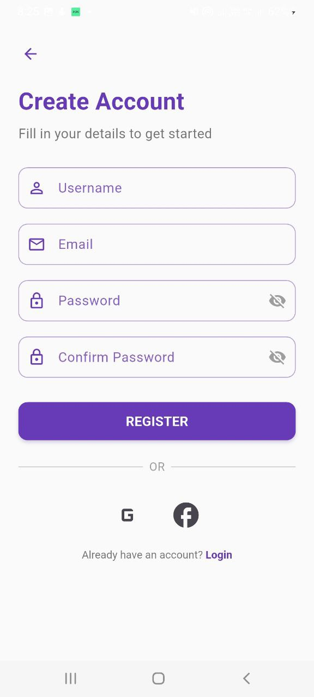  
  .jpg)  
  .jpg)  
  .jpg)  
  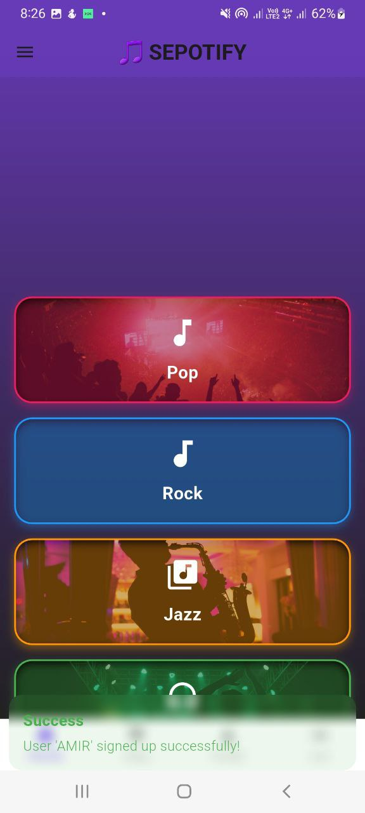

- Login / Lock  
  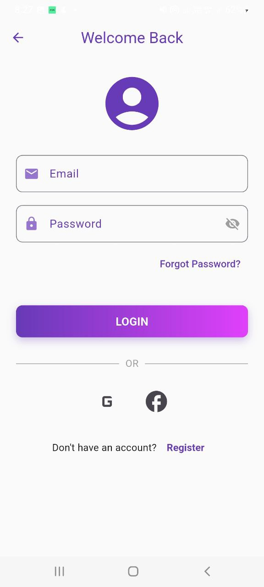  
    
  .jpg)

- Reset Password  
  

---

### 👤 Profile & Settings
- Profile  
  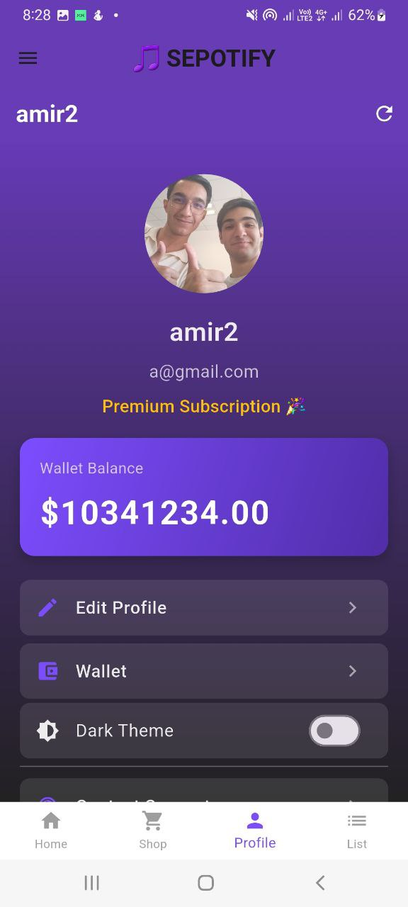  
  .jpg)

- Edit Profile  
  

- Change Profile Image  
  

- Sidebar  
  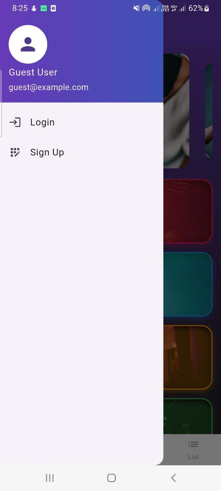  
  

- Theme  
  

- Delete Account  
  

---

### 💳 Wallet & Subscription
- Wallet  
  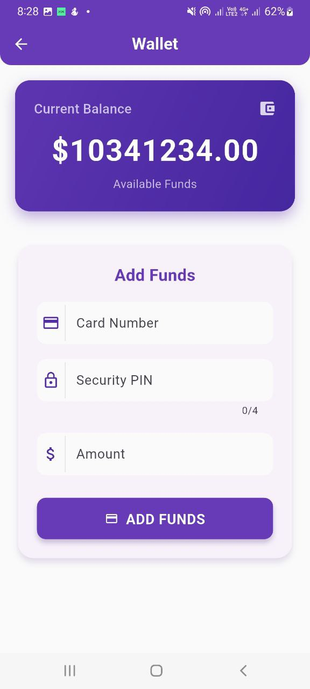

- Buy Subscription  
  

---

### 🎵 Music Experience (User Flow)
- Shop After Login  
  

- Purchase Ability  
  

- Support  
  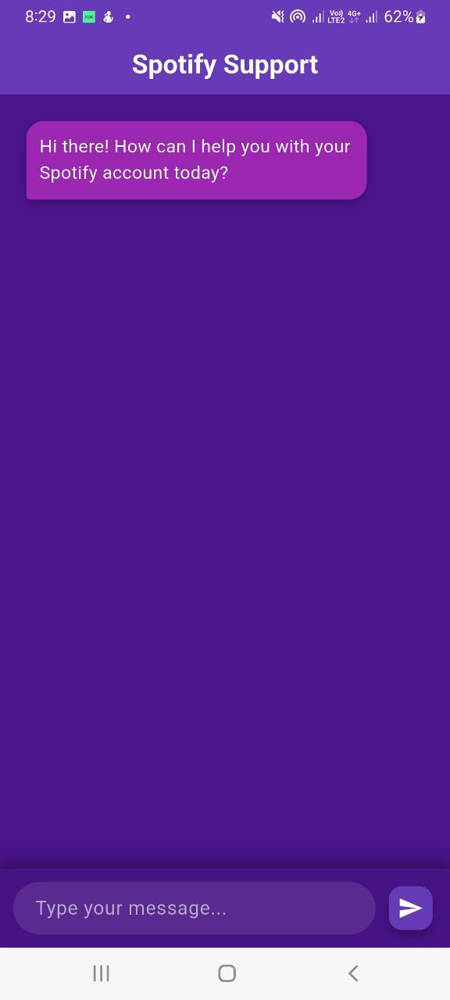

---

### 🎼 Songs & Player Screens
- App Intro / Onboarding  
  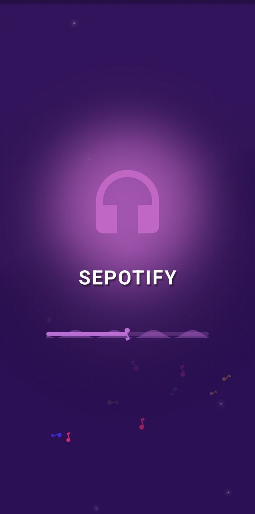  
    
  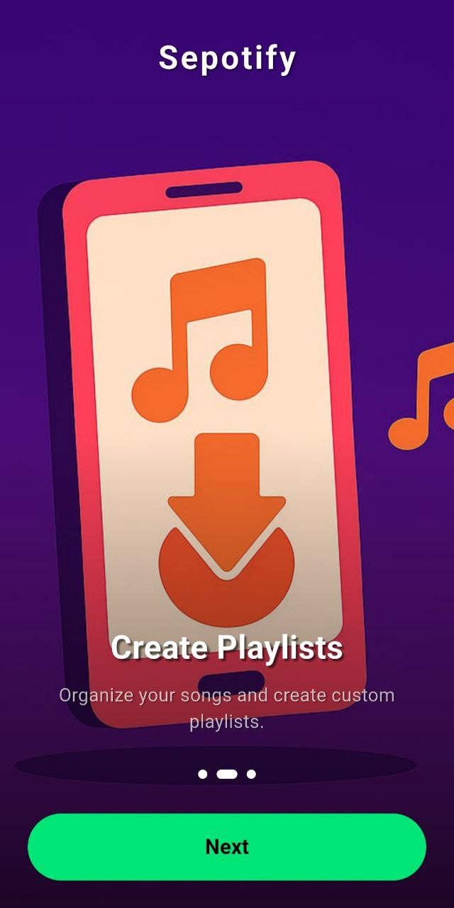  
  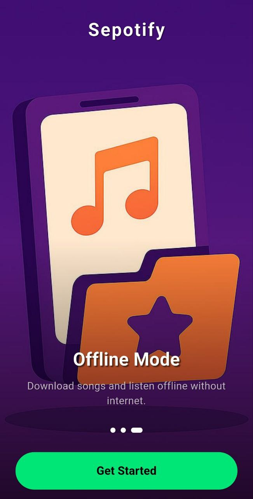

- Home  
  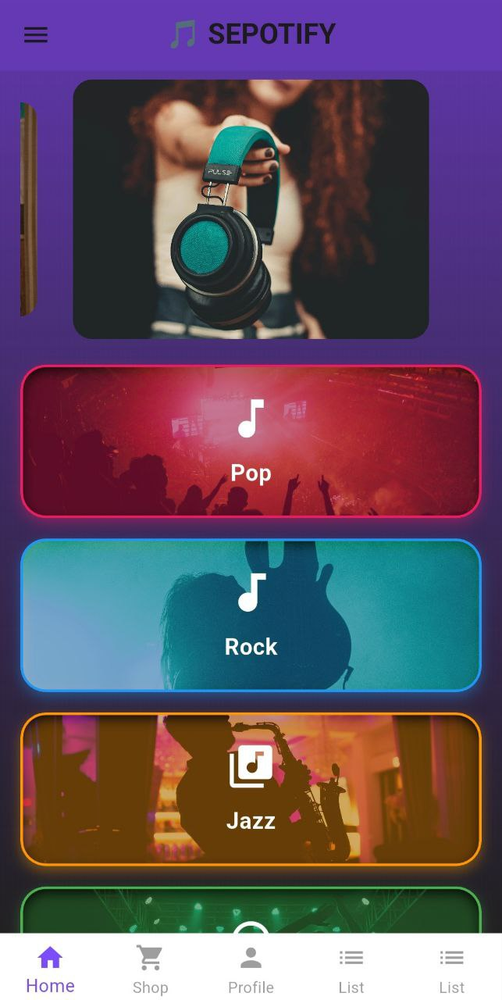  
  .jpg)  
  .jpg)

- Song Lists  
  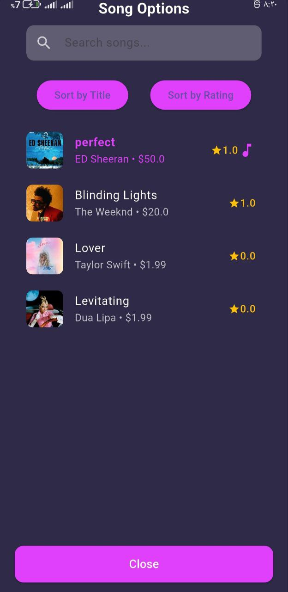  
  .jpg)  
  .jpg)

- Song Details / Player  
  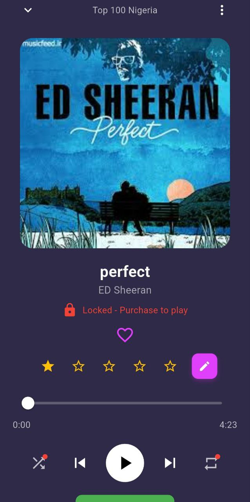  
  .jpg)  
  .jpg)  
  .jpg)  
  .jpg)  
  .jpg)

- Extra Features  
    
    
    
    
  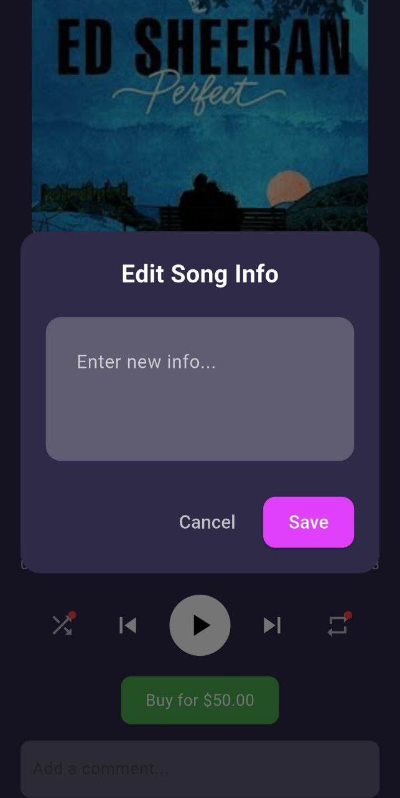

---

## 🛠️ Installation
1. Clone the repo:
   ```bash
   git clone https://github.com/YourUsername/FinalProject.git
